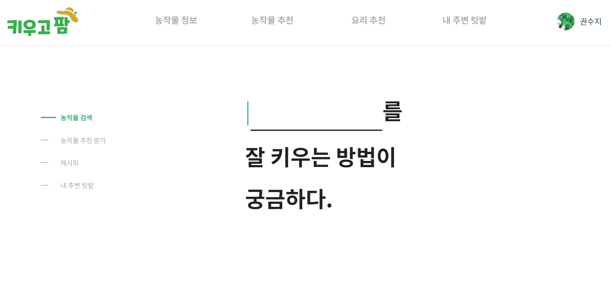

# 키우고팜 Project

<br>

## 👪 개발 멤버 소개

<table> <tr> <td height="140px" align="center"> <a href="https://github.com/dolpongg"> <br><br> 👑 정연우 <br>(Full-Stack) </a> <br></td> <td height="140px" align="center"> <a href="https://github.com/xswaqz">  <br><br> 😆 한지원 <br>(Full-Stack) </a> <br></td> <td height="140px" align="center"> <a href="https://github.com/mickeyshoes"> <br><br> 😶 권수지 <br>(Full-Stack) </a> <br></td> <td height="140px" align="center"> <a href="https://github.com/YongjaeKwon"><br><br> 🙄 윤건웅 <br>(Full-Stack) </a> <br></td> <td height="140px" align="center"> <a href="https://github.com/moxnox63">  <br><br> 😁 박하윤 <br>(Full-Stack) </a> <br></td> <td height="140px" align="center"> <a href="https://github.com/HanKyeon"> <br><br> 🙂 조성주 <br>(Full-Stack) </a> <br></td> </tr> 
<tr> 
<td align="center">CI/CD<br>Figma 목업 작성<br>추천 알고리즘 구현<br>농작물 추천페이지 FE 구현</td>
<td align="center">농작물정보 API 구현<br>검색페이지 API 구현<br>노션관리<br>문서작업<br>UCC기획 및 편집</td> 
<td align="center">레시피추천 및 상세 FE<br>레시피 즐겨찾기 API 구현<br>화면시연 gif 제작<br>발표자료 제작</td>
<td align="center">메인페이지FE<br>농작물 검색페이지FE<br>농작물 상세페이지FE<br>헤더 UI<br>레이아웃<br>로그인/회원가입<br>공통 Axios</td>
<td align="center">레시피 추천 페이지 FE<br>레시피 조회기능 BE<br>레시피 검색,추천기능 BE<br>레시피 데이터크롤링<br>레시피 데이터 MySQL 입력 및 정제</td>
<td align="center">소셜로그인 구현<br>유저 API 구현<br>텃밭데이터 정제<br>텃밭 조회,검색,찜하기 BE <br>노션 및 GitLab 정리</td>
</tr> </table>

<br />

## 📆 프로젝트 기간 

### 24.02.26. ~ 23.04.04

- 기획 및 설계 : 24.02.26 ~ 23.03.08
- 프로젝트 구현 : 24.03.09 ~ 23.03.29
- 버그 수정 및 산출물 정리 : 24.03.30 ~ 23.04.04

<br />


## 💡 서비스 소개

### 키우고팜

>집이나 텃밭에서 농작물을 키우고 싶어하는 사람들을 위한 개인 맞춤형 농작물 추천 서비스
 <br /><br />소소하게 농작물을 키워보고 싶은 분들을 위한 서비스입니다. 사용자의 취향과 환경에 맞는 농작물을 추천하는 기능과 함께, 특정 농작물로 만들 수 있는 레시피 추천 및 설명 기능도 제공되고 있습니다. 또한 사용자 위치 주변에 분양받을 수 있는 텃밭에 대한 정보도 제공됩니다.

<br/>

## 🛠️ 기술 스택

#### Front

      

#### Back

   <br/>  

#### CI/CD

  

#### 기타


#### 협업 툴

  

<details><summary> <b> 상세 기술스택 및 버전</b> </summary>

| 구분     | 기술스택           | 상세내용                  | 버전              |
| -------- | ------------------ | ------------------------- | ----------------- |
| 공통     | Gitlab             | 형상관리                  | \-                |
|          | Jira               | 이슈관리                  | \-                |
|          | Mattermost, Notion | 커뮤니케이션              | \-                |
| BackEnd  | MySQL              | DBMS                      | 8.0.36           |
|          | Java               | OpenJDK                   |17         |
|          | Spring Boot        | Java Server Framework     | 3.2.3            |
|          | JPA                |                           | 3.2.4              |
|          | IntelliJ           | IDE                       | \-                |
|          | Flask           |                        | \-                |
|          | OAuth2             |                           |\-            |
|          | Gradle             | Build                     | 8.5            |
| FrontEnd | Vue.js           | 프론트 프레임워크         | 3.4.21           |
|          | Tailwind           | CSS 라이브러리            |3.4.1           |
|          | axios              | API 통신 라이브러리       | 1.6.7             |
|          | IDE                | Visual Studio Code        | \-          |
| Server   | AWS EC2            | Server                    | \-                |
|          | Nginx              |                           |1.24.0       |
|          | Docker             |                           |25.0.4            |
|          | Jenkins             |                           |2.448            |

</details>

<br />


## 👥 협업 관리

### 🏞Git Flow

git flow 사용을 위해 `우아한 형제들`의 [git flow 사용](https://techblog.woowahan.com/2553/)을 참고했습니다. 각자 맡은 기능에 맞게 `feature` 브랜치를 생성하고, 완료된 기능은 `develop`에 merge하여 사용했습니다. 충돌 상황을 최소화하고자 매일 오전 스크럼에 `develop` 최신 버전을 `pull`받고 시작할 것을 강조했습니다.<br/>
**브랜치 작성 방법** : `feature/FE or BE/기능 이름`<br/>
**예시** : feature/FE/Login

또한 `commit message` 는 `[Prefix]type:Message ` 와 같이 통일하여 작성했습니다.

Prefix : FE, BE

Type:
```update : 기존의 기능 수정
- add : 새로운 기능 추가
- update : 기존의 기능 수정
- delete: 기존의 파일 삭제
- fix : 버그를 고친 경우
- rename : 이름 변경이 있을 때
- chore : 빌드 태스트 업데이트, 패키지 매니저를 설정하는 경우
- test : 테스트 코드 추가, 테스트 리팩토링
- build : 시스템 또는 외부 종속성에 영향을 미치는 변경사항 (npm, gulp, yarn 레벨)
- ci : CI관련 설정 style : 코드 의미에 영향을 주지 않는 변경사항 (포맷, 세미콜론 누락, 공백 등)
- refactor : 성능 개선
```

Message: 제목 작성

ex) [FE]feat:메인 페이지 로고수정

<br/>

### 📋 Jira

매주 월요일 오전 회의에서 차주에 진행되어야 할 이슈를 백로그에 등록했습니다. 금주에 완료하지 못한 이슈나, 앞으로 진행할 이슈들을 추가합니다.

- 에픽은 가장 큰 단위 기준으로 구성하였습니다.

- 스토리는 실제 유저 플로우를 고려하여 `홈페이지에서 로그인 창을 통해 로그인 한다` 와 같이 작성하였으며,

- 이슈는 스토리를 완료하기 위한 작은 업무 단위로 생성했습니다.
- 에픽링크 태그를 사용하여 이슈를 구별하기 쉽게 했습니다.
- 무엇보다 담당자와 스토리 포인트 설정, 현재 작업중인 내용 지라에 실시간으로 반영하는 것을 가장 중요하게 생각했습니다.

<br/>


### 📝Notion

모두가 공유해야할 자료 및 링크는 노션에 정리했습니다. 특히 `userflow`와 같이 여러번 다시 봐야하고 중요한 정보들은 특히 노션에 공유하여 불필요한 커뮤니케이션 리소스를 줄이기 위해 노력했습니다.

프로젝트 컨벤션, 문서, 참고자료, 산출물, 데일리 스크럼 등을 설정했습니다.


<br/>

## 프로젝트 구조

### 1. 아키텍처


<br/>

### 2. ERD


<br/>

## 실제 서비스 화면

#### 메인페이지

<hr>


#### 농작물

<hr>

##### 농작물 검색



##### 농작물 필터링


##### 농작물 추천


##### 농작물 상세


<br>

####  레시피

<hr>

##### 레시피 추천


##### 레시피 상세


<br>

####  텃밭

<hr>


<br>

#### 마이페이지
<hr>

##### 찜한 농작물, 레시피, 텃밭 조회


<br />


